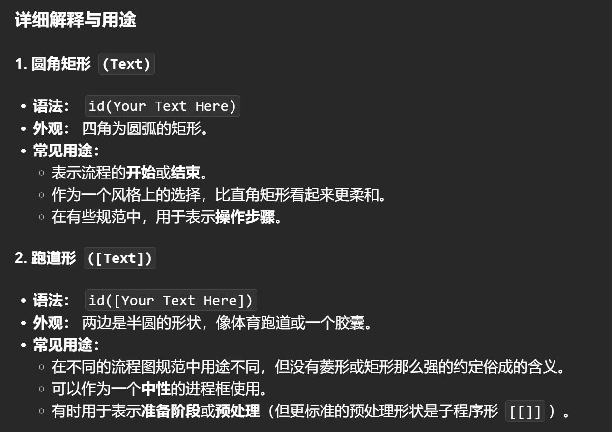

```Mermaid
flowchart LR
    id1(This is the text in the box)
    id2([This is the text in the box])
    id3[(Database)]
    id4((This is the text in the circle))
    id5>This is the text in the box]
    id6[[This is the text in the box]]
    id7{This is the text in the box}
    id8{{This is the text in the box}}
    
```


