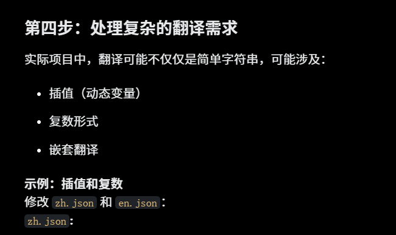
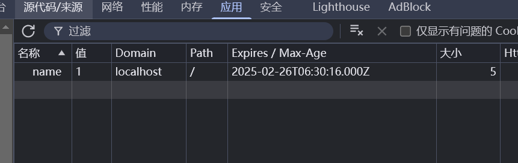
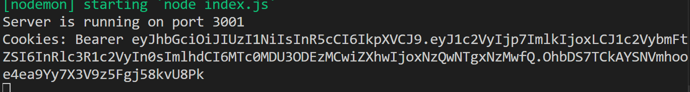
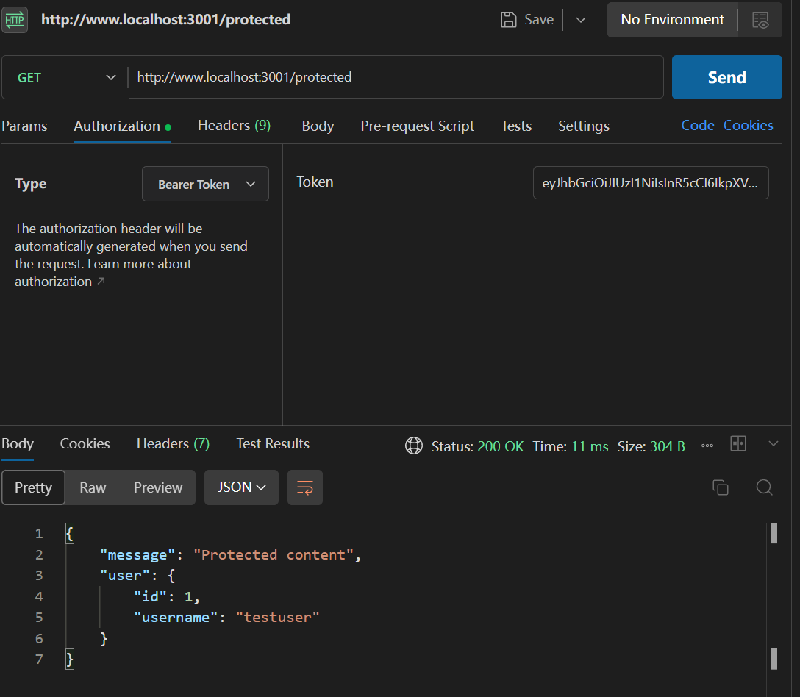
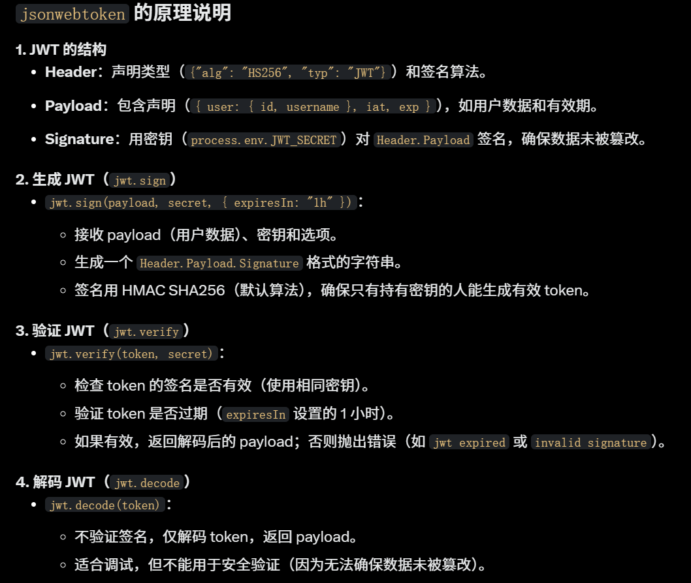
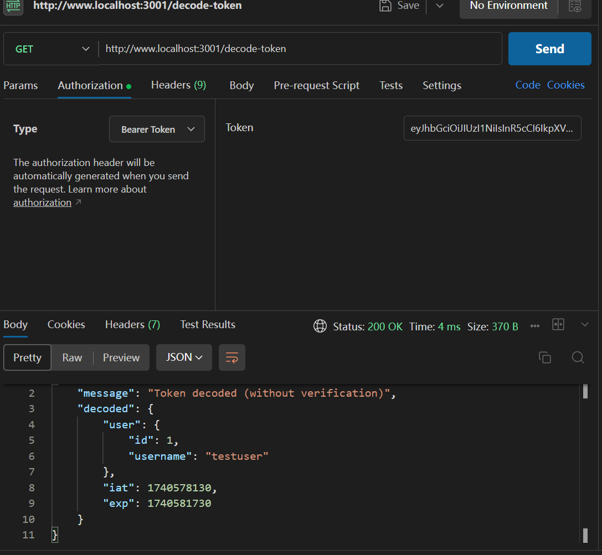
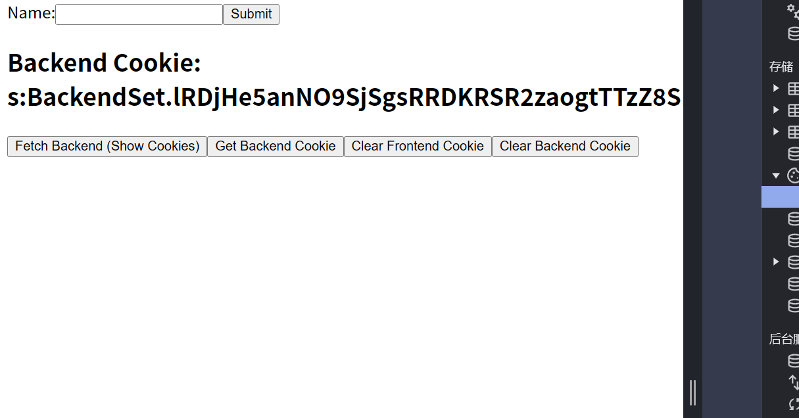
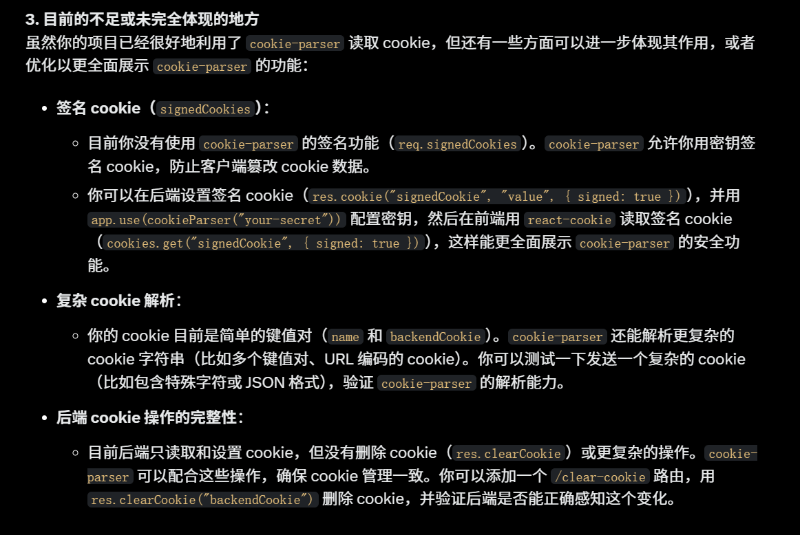

<h1  align="center">cookie-parser 库的学习</h1>

[cookie-parser 文档](https://www.npmjs.com/package/cookie-parser)

# 初始化`git`仓库

```sh
git init
git checkout -b cookie-parser
git commit -m "first commit"
git remote add origin git@github.com:lushiheng123/Node_React_libraries.git
git push -u origin cookie-parser
```

# 1. 初始化前后端,安装 cookie-parser

### 前端:`npm create vite@latest./`

### 后端：`npm init`,`npm install express nodemon dotenv cookie-parser`

#### 后端`package.json`设置为`"type":"module"`和`"server":"nodemon index.js"`

### 写一个简单的后端`index.js`

```js
import express from "express";
import dotenv from "dotenv";
import cookieParser from "cookie-parser";

dotenv.config();
const app = express();
app.use(cookieParser());

app.get("/", (req, res) => {
  console.log("Cookies:", req.cookies);
  console.log("Signed Cookies", req.signedCookies);
  res.send(`
    <h1>hello world</h1>
    <h2>${JSON.stringify(req.cookies)}</h2>
    <h2>${JSON.stringify(req.signedCookies)}</h2>
  `);
});

app.listen(process.env.PORT || 4000, () => {
  console.log(`Listening on port ${process.env.PORT || 4000}`);
});
```

### 测试一下访问`http://www.localhost:4000/`

### `终端`


### 渲染


# 2. 前端用`react-cookie`设置 cookie，用简单的 useCookies 钩子

> npm install react-cookie

### 修改好的`App.js`

```jsx
import React, { useState } from "react";
import { useCookies } from "react-cookie";

export default function App() {
  const [inputValue, setInputValue] = useState("");
  const [cookies, setCookie] = useCookies(["name"]);

  const handleSubmit = (e) => {
    e.preventDefault();
    onChange(inputValue);
  };

  const onChange = (newName) => {
    setCookie("name", newName);
  };

  return (
    <div>
      <form onSubmit={handleSubmit}>
        <label>
          Name:
          <input
            type="text"
            value={inputValue}
            onChange={(e) => setInputValue(e.target.value)}
          />
        </label>
        <button type="submit">Submit</button>
      </form>
      <div>{cookies.name && <h1>Hello {cookies.name}!</h1>}</div>
    </div>
  );
}
```

### 前端的效果:可以有 cookie




# 3. 因为前后端不一个端口，互通不了，用`后端`安装`CORS`组件去做到跨域，或者 `axios`

> npm install cors

# 4. 先做到后端获取前端的 cookie

### `index.js`

```js
import express from "express";
import dotenv from "dotenv";
import cookieParser from "cookie-parser";
import cors from "cors"; // 安装：npm install cors

dotenv.config();
const app = express();

// 启用 CORS，允许来自前端的请求（例如 localhost:5173）
app.use(
  cors({
    origin: `${process.env.CLIENT_SERVER}`, // 替换为你的前端运行端口
    credentials: true, // 允许发送 cookies
  })
);

// 启用 cookie-parser
app.use(cookieParser());

// 读取 cookie 的路由
app.get("/", (req, res) => {
  console.log("Cookies:", req.cookies);
});

// 启动服务器
app.listen(process.env.SERVER_PORT || 4000, () => {
  console.log(`Listening on port ${process.env.PORT || 4000}`);
});
```

### `App.jsx`

```jsx
import React, { useState } from "react";
import { useCookies } from "react-cookie";

export default function App() {
  const [inputValue, setInputValue] = useState("");
  const [cookies, setCookie] = useCookies(["name"]);
  const [backendResponse, setBackendResponse] = useState(null); // 存储后端返回的数据

  const handleSubmit = (e) => {
    e.preventDefault();
    onChange(inputValue);
    getClientCookieSendToBackend(); // 提交后请求后端
  };

  const onChange = (newName) => {
    setCookie("name", newName, {
      path: "/", // 确保路径与后端一致
      secure: false, // 开发环境用 false
      sameSite: "Lax", // 允许跨域请求
    });
  };

  const getClientCookieSendToBackend = () => {
    fetch("http://localhost:4000/", {
      method: "GET",
      credentials: "include", // 确保发送 cookie
    })
      .then((response) => response.text())
      .then((data) => setBackendResponse(data))
      .catch((error) => console.error("Error fetching backend:", error));
  };

  return (
    <div>
      <form onSubmit={handleSubmit}>
        <label>
          Name:
          <input
            type="text"
            value={inputValue}
            onChange={(e) => setInputValue(e.target.value)}
          />
        </label>
        <button type="submit">Submit</button>
      </form>
      <div>{cookies.name && <h1>Hello {cookies.name}!</h1>}</div>
      {backendResponse && (
        <div dangerouslySetInnerHTML={{ __html: backendResponse }} />
      )}
    </div>
  );
}
```

### 效果：当提交表单，会显示前端的 cookie 在后端上，代表获取成功




# 5. 在这个基础上我们再设置将后端设置的 cookie 送给前端使用

### `App.jsx`

```jsx
import React, { useState } from "react";
import { useCookies } from "react-cookie";

export default function App() {
  const [inputValue, setInputValue] = useState("");
  const [cookies, setCookie, removeCookie] = useCookies([
    "name",
    "backendCookie",
  ]); // 改成 backendCookie
  const [backendResponse, setBackendResponse] = useState(null); // 存储后端返回的数据

  const handleSubmit = (e) => {
    e.preventDefault();
    onChange(inputValue);
    getClientCookieSendToBackend(); // 提交后请求后端
  };

  const onChange = (newName) => {
    setCookie("name", newName, {
      path: "/", // 确保路径与后端一致
      secure: false, // 开发环境用 false
      sameSite: "Lax", // 允许跨域请求
    });
  };

  // 实际上是从送给后端
  const getClientCookieSendToBackend = () => {
    fetch("http://localhost:4000/", {
      method: "GET",
      credentials: "include", // 确保发送 cookie
    })
      .then((response) => response.text())
      .then((data) => setBackendResponse(data))
      .catch((error) => console.error("Error fetching backend:", error));
  };

  // 设置一个按钮，从后端获取 set-cookie 中的 cookie
  const Backend_set_cookie = () => {
    fetch("http://localhost:4000/set-cookie", {
      method: "GET",
      credentials: "include", // 确保发送 cookie
    })
      .then((res) => res.json())
      .then((data) => {
        console.log("Backend response:", data); // 调试用
        setBackendResponse(data.message); // 更新后端响应消息
        // 后端设置的 cookie 应该自动被浏览器和 useCookies 捕获，不需要额外 setCookie
      })
      .catch((error) => console.error("Error fetching set-cookie:", error));
  };

  return (
    <div>
      <form onSubmit={handleSubmit}>
        <label>
          Name:
          <input
            type="text"
            value={inputValue}
            onChange={(e) => setInputValue(e.target.value)}
          />
        </label>
        <button type="submit">Submit</button>
      </form>
      <div>
        {/* 显示前端设置的 cookie */}
        {cookies.name && <h1>Frontend Cookie (Name): {cookies.name}</h1>}
        {/* 显示后端设置的 cookie */}
        {cookies.backendCookie && (
          <h2>Backend Cookie: {cookies.backendCookie}</h2>
        )}
      </div>
      {backendResponse && <p>Backend Response: {backendResponse}</p>}
      <button onClick={handleSubmit}>Fetch Client Cookie (Show Cookies)</button>
      <button onClick={Backend_set_cookie}>Get Backend Cookie</button>
      <button onClick={() => removeCookie("name", { path: "/" })}>
        Clear Frontend Cookie
      </button>
      <button onClick={() => removeCookie("backendCookie", { path: "/" })}>
        Clear Backend Cookie
      </button>
    </div>
  );
}
```

### `index.js`

```js
import express from "express";
import dotenv from "dotenv";
import cookieParser from "cookie-parser";
import cors from "cors"; // 安装：npm install cors

dotenv.config();
const app = express();

// 启用 CORS，允许来自前端的请求（例如 localhost:5173）
app.use(
  cors({
    origin: `${process.env.CLIENT_SERVER}`, // 替换为你的前端运行端口
    credentials: true, // 允许发送 cookies
  })
);

// 启用 cookie-parser
app.use(cookieParser());

// 读取 cookie 的路由
app.get("/", (req, res) => {
  console.log("Cookies:", req.cookies);
  res.send(`
    <h1>Hello World</h1>
    <h2>All Cookies: ${JSON.stringify(req.cookies)}</h2>
  `);
});

app.get("/set-cookie", (req, res) => {
  // 后端设置一个 cookie 送给前端
  res.cookie("backendCookie", "BackendSet", {
    // 改成英文名称
    path: "/",
    expires: new Date(Date.now() + 7 * 24 * 60 * 60 * 1000), // 7 天后过期
    secure: false, // 开发环境用 false
    sameSite: "Lax", // 允许跨域请求
  });
  res.json({ message: "Cookie set from backend" });
});

// 启动服务器
app.listen(process.env.SERVER_PORT || 4000, () => {
  console.log(`Listening on port ${process.env.SERVER_PORT || 4000}`);
});
```

### 效果：前端页面控制获取后端 cookie





# 6. 体现 cookie-parser `签名`的作用

### App.jsx

```jsx
import React, { useState } from "react";
import { useCookies } from "react-cookie";

export default function App() {
  const [inputValue, setInputValue] = useState("");
  const [cookies, setCookie, removeCookie] = useCookies([
    "name",
    "backendCookie",
  ]); // 监听 name 和 backendCookie
  const [backendResponse, setBackendResponse] = useState(null); // 存储后端返回的数据

  const handleSubmit = (e) => {
    e.preventDefault();
    onChange(inputValue);
    fetchBackend(); // 提交后请求后端
  };

  const onChange = (newName) => {
    setCookie("name", newName, {
      path: "/",
      secure: false,
      sameSite: "Lax",
    });
  };

  const fetchBackend = () => {
    fetch("http://localhost:4000/", {
      method: "GET",
      credentials: "include", // 确保发送 cookie
    })
      .then((response) => response.text())
      .then((data) => setBackendResponse(data))
      .catch((error) => console.error("Error fetching backend:", error));
  };

  const Backend_set_cookie = () => {
    fetch("http://localhost:4000/set-cookie", {
      method: "GET",
      credentials: "include", // 确保发送 cookie
    })
      .then((res) => res.json())
      .then((data) => {
        console.log("Backend response:", data);
        setBackendResponse(data.message);
        // 读取签名 cookie
        const signedCookie = cookies.get("backendCookie", { signed: true });
        console.log("Signed cookie value:", signedCookie);
      })
      .catch((error) => console.error("Error fetching set-cookie:", error));
  };

  const clearBackendCookie = () => {
    fetch("http://localhost:4000/clear-cookie", {
      method: "GET",
      credentials: "include",
    })
      .then((res) => res.json())
      .then((data) => {
        setBackendResponse(data.message);
        removeCookie("backendCookie", { path: "/" });
      })
      .catch((error) => console.error("Error clearing cookie:", error));
  };

  return (
    <div>
      <form onSubmit={handleSubmit}>
        <label>
          Name:
          <input
            type="text"
            value={inputValue}
            onChange={(e) => setInputValue(e.target.value)}
          />
        </label>
        <button type="submit">Submit</button>
      </form>
      <div>
        {/* 显示前端设置的 cookie */}
        {cookies.name && <h1>Frontend Cookie (Name): {cookies.name}</h1>}
        {/* 显示后端设置的 cookie */}
        {cookies.backendCookie && (
          <h2>Backend Cookie: {cookies.backendCookie}</h2>
        )}
      </div>
      {backendResponse && <p>Backend Response: {backendResponse}</p>}
      <button onClick={handleSubmit}>Fetch Backend (Show Cookies)</button>
      <button onClick={Backend_set_cookie}>Get Backend Cookie</button>
      <button onClick={() => removeCookie("name", { path: "/" })}>
        Clear Frontend Cookie
      </button>
      <button onClick={clearBackendCookie}>Clear Backend Cookie</button>
    </div>
  );
}
```

### index.js

```js
import express from "express";
import dotenv from "dotenv";
import cookieParser from "cookie-parser";
import cors from "cors"; // 安装：npm install cors

dotenv.config();
const app = express();

// 启用 CORS，允许来自前端的请求（例如 localhost:5173）
app.use(
  cors({
    origin: `${process.env.CLIENT_SERVER}`, // 替换为你的前端运行端口
    credentials: true, // 允许发送 cookies
  })
);

// 启用 cookie-parser（设置密钥）
app.use(cookieParser("zhenghaoxi")); // 设置签名密钥

// 读取 cookie 的路由
app.get("/", (req, res) => {
  console.log("Cookies:", req.cookies);
  console.log("Signed Cookies:", req.signedCookies); // 打印签名 cookie
  res.send(`
    <h1>Hello World</h1>
    <h2>All Cookies: ${JSON.stringify(req.cookies)}</h2>
    <h2>Signed Cookies: ${JSON.stringify(req.signedCookies)}</h2>
  `);
});

app.get("/set-cookie", (req, res) => {
  // 后端设置一个签名 cookie 送给前端
  res.cookie("backendCookie", "BackendSet", {
    path: "/",
    expires: new Date(Date.now() + 7 * 24 * 60 * 60 * 1000), // 7 天后过期
    secure: false, // 开发环境用 false
    sameSite: "Lax", // 允许跨域请求
    signed: true, // 设置为签名 cookie
  });
  res.json({ message: "Signed cookie set from backend" });
});

app.get("/clear-cookie", (req, res) => {
  // 清除后端设置的 cookie
  res.clearCookie("backendCookie", {
    path: "/",
    secure: false,
    sameSite: "Lax",
  });
  res.json({ message: "Cookie cleared from backend" });
});

// 启动服务器
app.listen(process.env.SERVER_PORT || 4000, () => {
  console.log(`Listening on port ${process.env.SERVER_PORT || 4000}`);
});
```

### 效果





```sh
根据你分享的截图和描述，你的 Backend Cookie 显示为：
s:BackendSet.SBEIo1IrvVgKW0tLJA9p2KVQqfiPIWIWFR
让我帮你分析这是什么意思，以及为什么后端设置的 backendCookie 会以这种格式显示在前端。
分析原因
1. 签名 cookie 的影响
从你之前修改的代码来看（特别是后端配置了 cookie-parser 并设置了签名密钥 your-secret-key，以及 res.cookie("backendCookie", "BackendSet", { signed: true, ... })），后端设置的 backendCookie 是一个签名 cookie。cookie-parser 在设置签名 cookie 时，会对 cookie 值（BackendSet）进行加密和签名，然后存储为一个带 s: 前缀的字符串。
格式解释：
s:BackendSet.SBEIo1IrvVgKW0tLJA9p2KVQqfiPIWIWFR 是签名 cookie 的标准格式：
s: 表示这是一个签名 cookie。
BackendSet 是原始值（未签名前的值）。
.SBEIo1IrvVgKW0tLJA9p2KVQqfiPIWIWFR 是签名部分（由 cookie-parser 用密钥 your-secret-key 生成的加密签名，用于验证数据完整性，防止篡改）。
为什么这样显示：
在前端，useCookies 或浏览器直接读取签名 cookie 时，会返回这个完整的签名字符串（s:BackendSet.SBEIo1IrvVgKW0tLJA9p2KVQqfiPIWIWFR），而不是原始的 BackendSet，除非你明确解码签名。
2. useCookies 的默认行为
你在 App.jsx 中用 const [cookies, setCookie, removeCookie] = useCookies(["name", "backendCookie"]) 读取 backendCookie。
默认情况下，useCookies 不会自动解码签名 cookie。你需要用 cookies.get("backendCookie", { signed: true }) 显式指定读取签名 cookie，react-cookie 才会用 cookie-parser 的密钥解码，得到原始值 BackendSet。
3. 后端配置的影响
你的后端设置了 app.use(cookieParser("your-secret-key")) 和 res.cookie("backendCookie", "BackendSet", { signed: true, ... })，这意味着 backendCookie 是一个签名 cookie。
req.cookies.backendCookie 在后端会返回签名后的字符串（s:BackendSet.SBEIo1IrvVgKW0tLJA9p2KVQqfiPIWIWFR），而 req.signedCookies.backendCookie 才会返回原始值 BackendSet（如果签名验证通过）。
为什么会这样？
签名 cookie 的设计：签名 cookie 的目的是防止客户端篡改 cookie 数据。cookie-parser 用密钥对 cookie 值签名，生成一个加密哈希（签名部分 .SBEIo1IrvVgKW0tLJA9p2KVQqfiPIWIWFR），然后存储为 s:值.签名 的格式。只有在后端或正确配置的前端（用相同密钥）才能解码还原原始值。
前端未解码：你在 App.jsx 中直接用 cookies.backendCookie 显示 backendCookie，但没有用 cookies.get("backendCookie", { signed: true }) 解码签名，因此显示的是签名后的完整字符串，而不是 BackendSet。
如何修正？
如果你希望前端显示后端设置的原始 cookie 值 BackendSet（而不是签名后的字符串），需要以下调整：
1. 后端保持不变（可选）
如果你仍然需要签名 cookie（为了安全），后端代码可以保持不变：
javascript
app.use(cookieParser("your-secret-key")); // 保持密钥
res.cookie("backendCookie", "BackendSet", {
  path: "/",
  expires: new Date(Date.now() + 7 * 24 * 60 * 60 * 1000),
  secure: false,
  sameSite: "Lax",
  signed: true, // 保持签名
});
但如果你不想用签名 cookie，可以移除 signed: true，直接设置普通 cookie：
javascript
res.cookie("backendCookie", "BackendSet", {
  path: "/",
  expires: new Date(Date.now() + 7 * 24 * 60 * 60 * 1000),
  secure: false,
  sameSite: "Lax",
});
2. 前端解码签名 cookie
修改 App.jsx，用 cookies.get("backendCookie", { signed: true }) 读取签名 cookie，获取原始值 BackendSet：
jsx
import React, { useState } from "react";
import { useCookies } from "react-cookie";

export default function App() {
  const [inputValue, setInputValue] = useState("");
  const [cookies, setCookie, removeCookie] = useCookies(["name", "backendCookie"]);
  const [backendResponse, setBackendResponse] = useState(null); // 存储后端返回的数据

  const handleSubmit = (e) => {
    e.preventDefault();
    onChange(inputValue);
    fetchBackend(); // 提交后请求后端
  };

  const onChange = (newName) => {
    setCookie("name", newName, {
      path: "/",
      secure: false,
      sameSite: "Lax",
    });
  };

  const fetchBackend = () => {
    fetch("http://localhost:4000/", {
      method: "GET",
      credentials: "include", // 确保发送 cookie
    })
      .then((response) => response.text())
      .then((data) => setBackendResponse(data))
      .catch((error) => console.error("Error fetching backend:", error));
  };

  const Backend_set_cookie = () => {
    fetch("http://localhost:4000/set-cookie", {
      method: "GET",
      credentials: "include", // 确保发送 cookie
    })
      .then((res) => res.json())
      .then((data) => {
        console.log("Backend response:", data);
        setBackendResponse(data.message);
        // 读取签名 cookie，获取原始值
        const backendCookieValue = cookies.get("backendCookie", { signed: true });
        console.log("Decoded backend cookie:", backendCookieValue); // 应该输出 "BackendSet"
      })
      .catch((error) => console.error("Error fetching set-cookie:", error));
  };

  return (
    <div>
      <form onSubmit={handleSubmit}>
        <label>
          Name:
          <input
            type="text"
            value={inputValue}
            onChange={(e) => setInputValue(e.target.value)}
          />
        </label>
        <button type="submit">Submit</button>
      </form>
      <div>
        {/* 显示前端设置的 cookie */}
        {cookies.name && <h1>Frontend Cookie (Name): {cookies.name}</h1>}
        {/* 显示后端设置的 cookie，使用解码后的值 */}
        {cookies.backendCookie && (
          <h2>Backend Cookie: {cookies.get("backendCookie", { signed: true }) || cookies.backendCookie}</h2>
        )}
      </div>
      {backendResponse && <p>Backend Response: {backendResponse}</p>}
      <button onClick={handleSubmit}>Fetch Backend (Show Cookies)</button>
      <button onClick={Backend_set_cookie}>Get Backend Cookie</button>
      <button onClick={() => removeCookie("name", { path: "/" })}>
        Clear Frontend Cookie
      </button>
      <button onClick={() => removeCookie("backendCookie", { path: "/" })}>
        Clear Backend Cookie
      </button>
    </div>
  );
}
说明：
用 cookies.get("backendCookie", { signed: true }) 读取签名 cookie，得到原始值 BackendSet。
在 UI 中替换 cookies.backendCookie 为 cookies.get("backendCookie", { signed: true })，显示解码后的值。
如果后端未签名 cookie（去掉 signed: true），直接用 cookies.backendCookie 即可显示 BackendSet。
验证步骤
启动后端：
确保安装了 express、dotenv、cookie-parser 和 cors。
运行 node index.js，后端监听在 localhost:4000（或 process.env.SERVER_PORT）。
确保 .env 文件中有 SERVER_PORT=4000 和 CLIENT_SERVER=http://localhost:5173。
启动前端：
用 Vite 运行 React 项目（npm run dev），通常在 localhost:5173。
打开浏览器，访问前端页面。
测试修正：
在前端输入名字（比如 “John”），点击 “Submit”，设置 name cookie。
点击 “Get Backend Cookie” 按钮，获取后端设置的 backendCookie。
确认前端显示 <h2>Backend Cookie: BackendSet</h2>（而不是签名字符串）。
检查浏览器开发者工具（F12 -> Application -> Cookies），确认 backendCookie 存储为 s:BackendSet.SBEIo1IrvVgKW0tLJA9p2KVQqfiPIWIWFR，但前端显示为解码后的 BackendSet。
点击 “Clear Backend Cookie” 按钮，确认 backendCookie 被删除。
注意事项
密钥一致性：确保前端和后端的 cookie-parser 密钥一致（your-secret-key）。如果密钥不匹配，react-cookie 无法解码签名 cookie。
开发环境：secure: false 适用于本地开发（HTTP），生产环境需用 HTTPS 并设 secure: true。
签名 cookie 的用途：签名 cookie 适合需要安全性的场景（如认证 token），但如果只是简单测试，可以去掉 signed: true，用普通 cookie。
下一步建议
测试非签名 cookie：
如果不需要签名功能，去掉后端的 signed: true 和 cookieParser 的密钥，测试普通 cookie 的显示（直接显示 BackendSet）。
安全性优化：
研究 httpOnly 和 sameSite 的最佳实践，确保 cookie 安全（生产环境用 secure: true 和 sameSite: "Strict"）。
扩展功能：
试试后端设置多个签名 cookie，或前端验证签名 cookie 的完整性，测试更复杂场景。
你试试修正后的代码，告诉我结果怎么样？如果还有报错或问题，贴出控制台日志或 cookie 详情，我再帮你细查！
```
