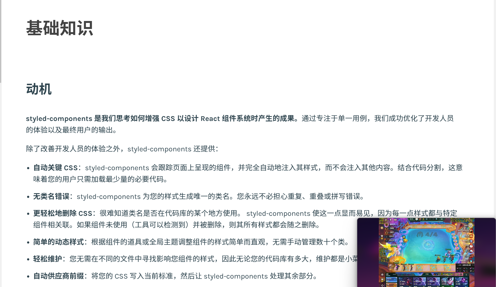
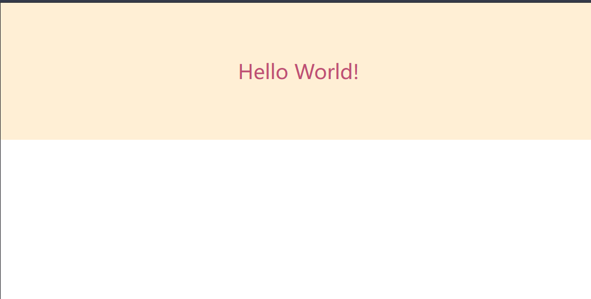
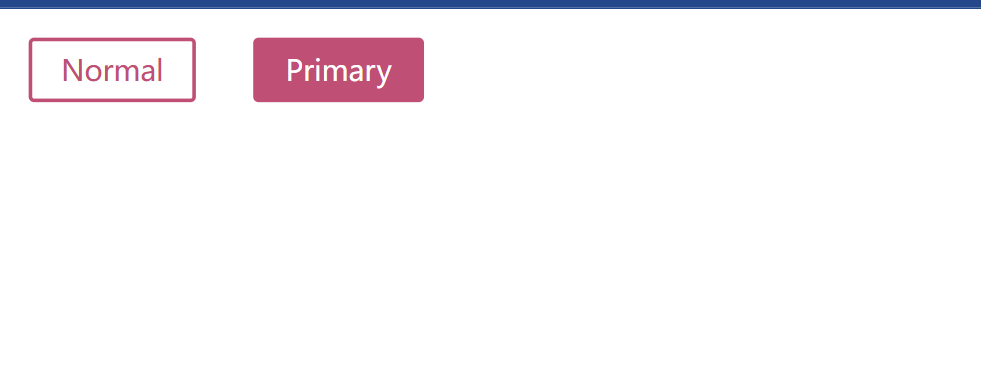

<h1 align = "center">Style-Components库学习</h1>

### [style-components](https://styled-components.com/docs/basics#motivation)

# 学习动机



```sh
git init
git checkout -b styled-components
git add .
git commit -m "first commit"
git remote add origin git@github.com:lushiheng123/Node_React_libraries.git
git push -u origin styled-components
```

```sh
git init
git git remote add origin git@github.com:lushiheng123/Node_React_libraries.git
git remote -v
git fetch origin
git branch -r
git pull origin styled-components
```

# 1. 环境:vite+tailwindcss+style-components

# 2. `import styled from "styled-components";`引入

### `App.jsx`

```jsx
import React from "react";
import styled from "styled-components";
export default function App() {
  // Create a Title component that'll render an <h1> tag with some styles
  const Title = styled.h1`
    font-size: 1.5em;
    text-align: center;
    color: #bf4f74;
  `;

  // Create a Wrapper component that'll render a <section> tag with some styles
  const Wrapper = styled.section`
    padding: 4em;
    background: papayawhip;
  `;
  return (
    <div className="bg-blue-500">
      <Wrapper>
        <Title>Hello World!</Title>
      </Wrapper>
    </div>
  );
}
```

### 效果



# 3. &props 前缀 的使用

###

```md
$primary 是传给 Button 组件的 prop，通过 props.$primary 在样式中动态控制：
background: $primary 为 true 时为 #BF4F74，否则为 white。
color: $primary 为 true 时为 white，否则为 #BF4F74。
$ 前缀避免了 primary 被传给底层 DOM（<button>），防止 React 警告。
在 <Button $primary> 中，$primary 为 true，所以样式应用深粉色背景和白色文字；<Button> 没有 $primary，相当于 false，所以是白色背景和深粉色文字。
```

```jsx
// src/App.jsx
import React from "react";
import styled from "styled-components";

const Button = styled.button`
  /* Adapt the colors based on primary prop */
  background: ${(props) => (props.$primary ? "#BF4F74" : "white")};
  color: ${(props) => (props.$primary ? "white" : "#BF4F74")};

  font-size: 1em;
  margin: 1em;
  padding: 0.25em 1em;
  border: 2px solid #bf4f74;
  border-radius: 3px;
`;

export default function App() {
  return (
    <div>
      <Button>Normal</Button>
      <Button $primary>Primary</Button>
    </div>
  );
}
```



# 4. （）直接继承

```jsx
// src/App.jsx
import React from "react";
import styled from "styled-components";

const Button = styled.button`
  color: #bf4f74;
  font-size: 1em;
  margin: 1em;
  padding: 0.25em 1em;
  border: 2px solid #bf4f74;
  border-radius: 3px;
`;

// A new component based on Button, but with some override styles
const TomatoButton = styled(Button)`
  color: tomato;
  border-color: tomato;
`;

export default function App() {
  return (
    <div>
      <Button>Normal Button</Button>
      <TomatoButton>Tomato Button</TomatoButton>
    </div>
  );
}
```

# 5. 用`as`转换标签,这里从 button 转换为了 a 便签，然后加上了 href

```jsx
// src/App.jsx
import React from "react";
import styled from "styled-components";

export default function App() {
  const Button = styled.button`
    display: inline-block;
    color: #bf4f74;
    font-size: 1em;
    margin: 1em;
    padding: 0.25em 1em;
    border: 2px solid #bf4f74;
    border-radius: 3px;
    display: block;
  `;

  // 只定义一次 TomatoButton，移除重复定义
  const TomatoButton = styled(Button)`
    color: tomato;
    border-color: tomato;
  `;

  return (
    <div>
      <Button>Normal Button</Button>
      <Button as="a" href="#">
        Link with Button styles
      </Button>
      <TomatoButton as="a" href="#">
        Link with Tomato Button styles
      </TomatoButton>
    </div>
  );
}
```
